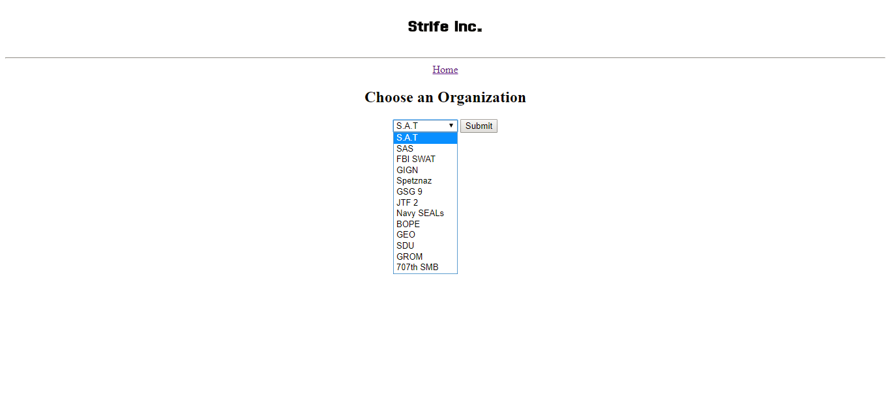
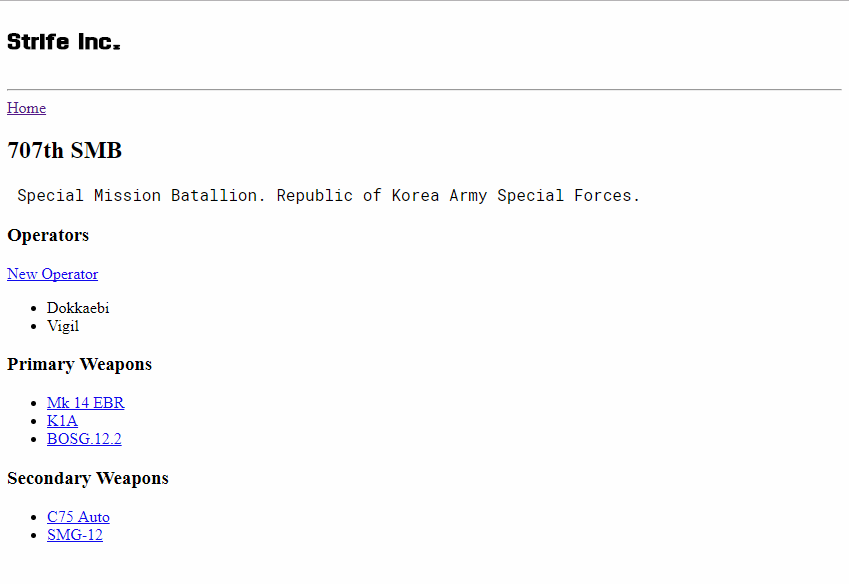
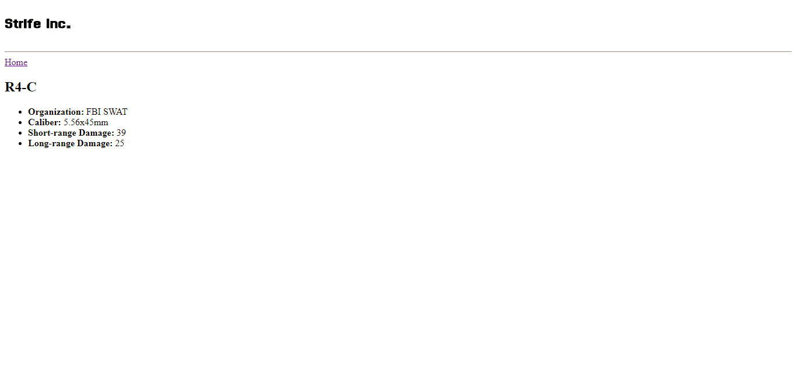

# Strife Inc.
----

Strife Inc. is named after the unofficial Rainbow Six: Siege team, "Strife Inc.". This is a data-driven web application, meant to display Strife Inc. team stats, as well as information about Organizations, Operators, and Weapons found in Rainbow Six: Siege.  

The application can be found at [Strife Inc](https://strifeinc.herokuapp.com)

## Site
---

### Org Selection

Here a user can select any organization available in the video game. Once submitted, the client is served the orgstats template.

### Org Info

Here the user can view all operators, primary weapons, and secondary weapons the selected organization has available.

Users can also select a listed weapon to retrieve the weapon template.

### Weapon

Here users can view weapon caliber and damage statistics.

## Mobile Support
---

Responsive design implementation planned for near future.

## Data
---

The SQLAlchemy Object Relational Mapper was used to create the SQLite database for this application. 

Database tables can be viewed [here](https://github.com/laceymwes/strife_inc/blob/master/Modeling/tables.png).

The scripts used to set up and populate the database can be viewed [here](https://github.com/laceymwes/strife_inc/blob/master/database_setup.py) and [here](https://github.com/laceymwes/strife_inc/blob/master/create_database.py) respectively.

## Release History
---

* 0.1.0 - Feb 5, 2018 - initial release

## Built with
---

* [SQLAlchemy](https://www.sqlalchemy.org/)
* [Flask](http://flask.pocoo.org/docs/0.12/)
* [Python](https://python.org)
* [SQLite](https://sqlite.org)

## What's next?
___

Following is a list of application functionality to be added in the near future:

* STYLING!!
	- App is currently has minimal styling.
* Operator comparisons.
	- Ability to select and compare two operators.
* Additional weapon statistics. 
	- Attributes like mobility rating, rate of fire, etc.
	- Currently accessories are not listed.
 organization. In-game, operators of the same organization have different weapons available to them.
* Strife Inc. team statistics.
	- Plans to utilize the R6Stats API to retrieve player stats.
* More accurate shotgun damage statistics.
	- Damage values for shotguns in this application are technically per pellet. Ex: 28 is actually 28 x 8 for each individual pellet/projectile.

## Team
---

[Michael Lacey](https://github.com/laceymwes)

* Database
* Python

## License
---

License